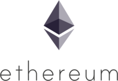

<p align="center">
  <a href="https://github.com/SergeyIvanovDevelop/Crypto-Steam-Platform">
    
  </a>
</p>
<h1 align="center">
  Crypto Steam Platform
</h1>

## Crypto Steam Platform &middot; [](./LICENSE) [](https://ethereum.org/en/) [](https://docs.soliditylang.org/en/v0.8.14/) [](https://nodejs.org/en/) [](https://en.wikipedia.org/wiki/JavaScript) [](https://www.mongodb.com/) [](https://www.docker.com/) [](https://github.com/features/actions) [](https://www.linkedin.com/in/sergey-ivanov-33413823a/) [](https://t.me/SergeyIvanov_dev) ##

The repository contains the code and configuration to run a platform for creating cryptocurrency stakes for arbitrary ERC20 tokens.

The project is built on the Ethereum blockchain and also contains a server part.

## :computer: Getting Started  ##

The project architecture is planned for its deployment through the CI/CD mechanism. In order for you to run a local copy of the entire project, follow these steps.

### :cd: Installation guide via CI/CD. LINUX only .

**In order to be able to deploy a project, a number of prerequisites must be met:**

- You need to create a [GitHub](https://github.com) repository to which you will push code from ***this repository***.
- You need to create an account on [DokcerHub](https://hub.docker.com/).
- You must have a remote machine with [docker](https://www.docker.com/), [docker-compose](https://docs.docker.com/compose/) and [openssh-server](https://www.openssh.com/) installed. *Ports on SSH must be opened (check this with [iptables](https://en.wikipedia.org/wiki/Iptables)).*
- You must create secret variables in your github repository under `GitHub Secrets`: `<YOUR_REPO_NAME>` :arrow_right: `Settings` :arrow_right: `Secrets` :arrow_right: `Actions` :arrow_right: `New repository secret`. List of variables:

  - Remote machine IP address: `HOST`
  - The username of the remote machine, on whose behalf the interaction via ssh will take place on this machine: `USERNAME`
  - Password for this user: `PASSWORD`
  - Your DockerHub username: `DOCKER_USERNAME`
  - Your DockerHub username password: `DOCKER_PASSWORD`


**Step 1**

1. Go to home directory and clone repository from github: `cd ~ && git clone https://SergeyIvanovDevelop@github.com/SergeyIvanovDevelop/Crypto-Steam-Platform`

**Step 2**<br>

2. Go to the directory of the downloaded repository: `cd ~/Crypto-Steam-Platform`

**Step 3**<br>

3. Change the origin value for the git repository to your GitHub repository: `git remote set-url origin <YOUR_GITHUB_REPOSITORY>`

**Step 4**<br>

_Create test blockchain network & deploy smart-contract_<br>

4. Change to the `solidity` branch: ```git checkout solidity```<br>
5. Push the code from this branch to your GitHub repository: ```git push -u origin solidity```<br>
6. Change to the `develop-solidity` branch: ```git checkout develop-solidity```<br>
7. Merging code from the `solidity` branch into the `develop-solidity` branch: ```git merge solidity```<br>
8. Push the code from this branch to your GitHub repository: ```git push -u origin develop-solidity```. This action should start the CI/CD process using GitHub Actions. As a result, a `truffle develop` test network will be deployed on your remote machine (via ssh). It is to it that you will need to connect using the [MetaMask](https://metamask.io/) extension to interact with the platform.<br>_IMPORTANT: Make sure the contract is deployed by truffle successfull (see logs of deployment job in branch `develop-solidity`)!!!_<br>

_Server Deployment_<br>

9. Change to the `backend` branch: ```git checkout backend```<br>
10. Push the code from this branch to your GitHub repository: ```git push -u origin backend```<br>
11. Change to the `develop-backend` branch: ```git checkout develop-backend```<br>
12. Merging code from the `backend` branch into the `develop-backend` branch: ```git merge backend```<br>
13. Push the code from this branch to your GitHub repository: ```git push -u origin develop-backend```. This action should start the CI/CD process using GitHub Actions. As a result, a server will be deployed on your remote machine (via ssh).<br>

_Deploying a site with nginx_<br>

14. Change to the `frontend` branch: ```git checkout frontend```<br>
15. Push the code from this branch to your GitHub repository: ```git push -u origin frontend```<br>
16. Change to the `develop-frontend` branch: ```git checkout develop-frontend```<br>
17. Merging code from the `frontend` branch into the `develop-frontend` branch: ```git merge frontend```<br>
18. Push the code from this branch to your GitHub repository: ```git push -u origin develop-frontend```. This action should start the CI/CD process using GitHub Actions. As a result, a nginx-server with site will be deployed on your remote machine (via ssh). To visit the site, you need to drive in the search bar of the browser (tested only in the Google Chrome browser _Version 98.0.4758.102 (Official build), (64 bit)_): `http://<REMOTE_HOST_SSH_IP-ADDRESS>:8888/`<br>

***Congratulations, you have successfully deployed the project!***<br>

### :heavy_check_mark: Using project ###

**In order to start using the project after its deployment, you must:**<br>
1. Install MetaMask Wallet (Google Chrome browser extension).<br>
2. Import the wallet whose mnemonic is in the logs of deployment job in branch `develop-solidity` (where truffle created test network).<br>
3. Import CST (Crypto Steam Token) token for this account, which are automatically credited to this account when deploying a smart contract. The smart contract address of the CST token will also be in the logs of deployment job in branch `develop-solidity` (where truffle created test network). Should be 18 CST.<br>
4. Open a second GoogleChrome window and sign in with a different Google account than the one in the first window (or don't sign in to any account at all). Install MetaMask Wallet (Google Chrome browser extension).<br>
5. Create a new MetaMask wallet, import the CST token and transfer some amount of CST and ETH from the account in the first window to this account. For example, 5 units of each.<br>
6. Open the first window Google Chrome. Go to the site. To do this, in the browser search bar, type: `http://<REMOTE_HOST_SSH_IP-ADDRESS>:8888/`.<br>
7. Connect your MetaMask wallet to the site.<br>
8. Choose to manually enter the smart contract address of the token you want to pledge as collateral (in checkbox).<br>
9. Copy the address of the CST smart contract into the appropriate field.<br>
10. Enter the number of tokens you want to deposit as collateral for your stake.<br>
11. Click the 'Create' button. An opponent waiting window will appear.<br>
12. Open the second window Google Chrome. Go to the site. To do this, in the browser search bar, type: `http://<REMOTE_HOST_SSH_IP-ADDRESS>:8888/`.<br>
13. Connect your MetaMask wallet to the site.<br>
14. Choose to manually enter the smart contract address of the token you want to pledge as collateral (in checkbox).<br>
15. Copy the address of the CST smart contract into the appropriate field.<br>
16. Select from the list of pending games, the game created by the user of the first Google Chrome window.<br>
17. Enter the number of tokens equal to or greater than the number of tokens given as collateral for the bet by the first user.<br>
18. Click on the 'Join' button. A game window should appear, the essence of which is to guess the number guessed by the server. (The user will see the same in the first window). Whose number will be closer to the mysterious server - he won. If the network connection is interrupted during the game, then the funds frozen in the bet will be returned to the owners (even if there was only one player).<br>
19. After the end of the game (or disconnection), you can check the balances of users.<br>
20. Note: if the MetaMask wallet of the smart contract creator is connected to the site, then the administration panel will be available, with which you can start/stop this smart contract (using the [pausable library](https://github.com/OpenZeppelin/openzeppelin-contracts/blob/master/contracts/security/Pausable.sol)).<br>

**:clapper: Example using (GIF):**<br>

	This animation demonstrates scenarios for using the Crypto Steam Platform.<br>


### :bookmark_tabs: Licence ###
Crypto Steam Platform is [CC BY-NC-SA 3.0 licensed](./LICENSE).
